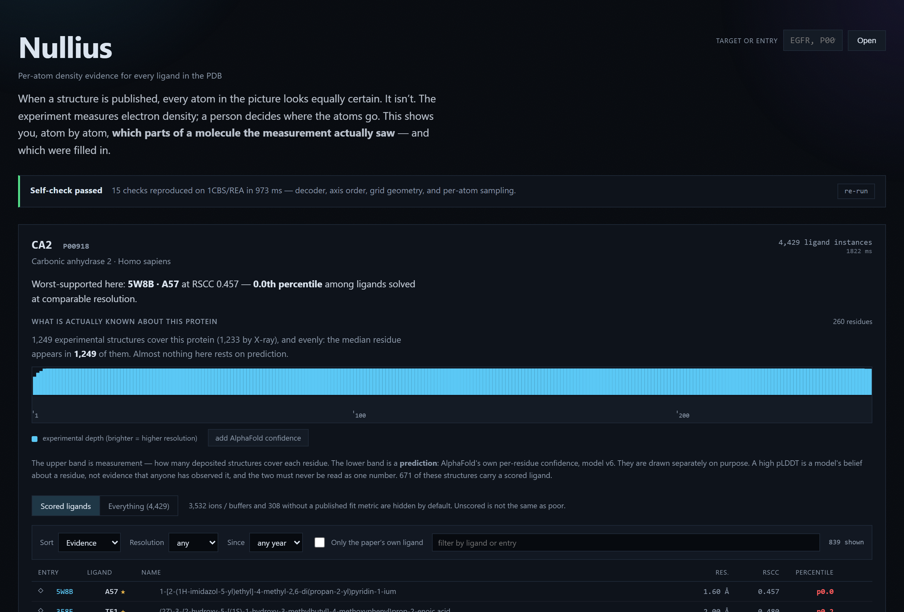
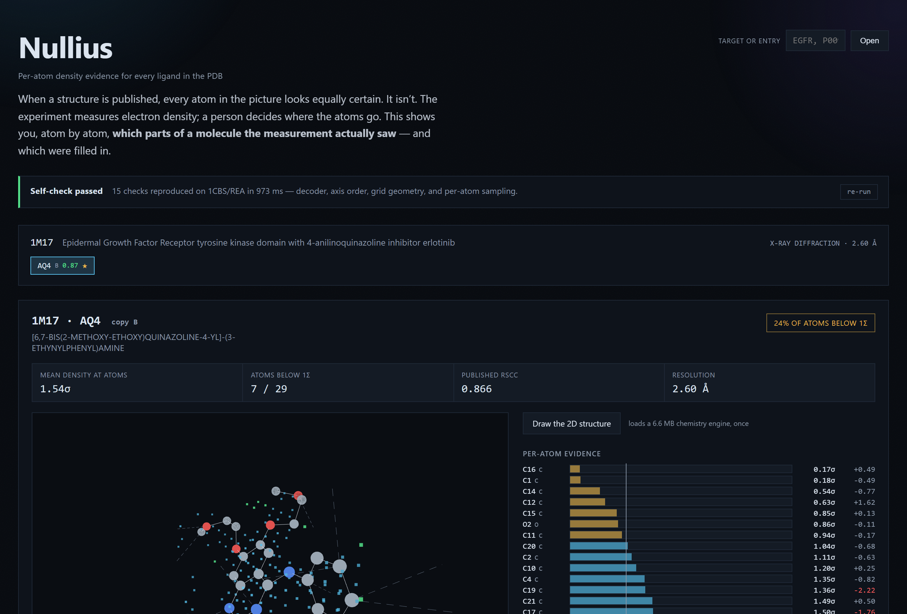
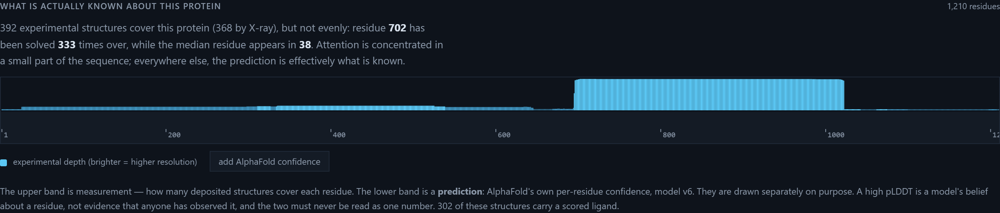
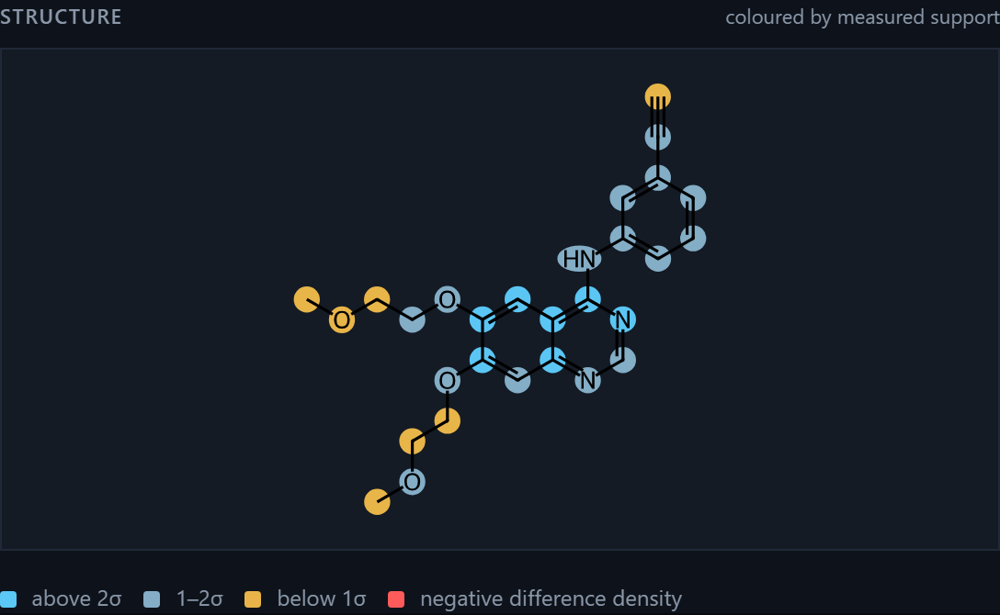

# Nullius

**Per-atom density evidence for every ligand in the PDB.**

When a structure is published, every atom in the picture looks equally certain. It isn't.
A crystallographic experiment measures *electron density* — a cloud. A person decides where
the atoms go inside that cloud. Usually they are right. Sometimes the density supports part
of a molecule and the rest is a reasonable guess, and the guess becomes a citable fact.

Nullius shows you, atom by atom, which parts of a modelled molecule the measurement
supports — and which were filled in. Named for `nullius in verba` — take nobody's word for it.

<p align="center">
  
</p>

Paste a protein and get every ligand ever modelled into it, ranked worst-evidence-first. Open one
and the electron density is fetched and decoded in your browser, then sampled at every atom.
Retinoic acid in 1CBS has every atom above 1σ (RSCC 0.949); a glycosylation sugar in 13FL has 21%
of its atoms below 1σ, with O4 sitting at 0.0σ over −1.8σ of *negative* difference density (RSCC
0.503). Same code, same pipeline, opposite verdict.

**Type any PDB entry** and every ligand in it is listed worst-supported first. A worked example:
erlotinib in the EGFR kinase ([`#1m17/AQ4/B`](https://bpachter.github.io/nullius/#1m17/AQ4/B))
has a published RSCC of 0.866 — respectable — but the per-atom view shows its two
methoxy-ethoxy tail carbons at **0.17σ and 0.18σ** while the quinazoline core sits at 2–3σ. The
solubilising side chain is disordered and the core is solid, which is exactly what a
medicinal chemist would want to know and exactly what a single summary number hides.

---

<p align="center">
  
</p>

## Why this is not just a viewer

The scarce thing here is not the 3D. It is being able to trust the number under it.

**The tool proves its own arithmetic before it prints anything.** On load it re-runs the entire
pipeline — fetch → BinaryCIF decode → axis reordering → grid geometry → trilinear sampling →
per-atom sigma — against a reference structure and compares 15 values to fixtures. If it cannot
reproduce them, it refuses to display numbers. A silently wrong sigma is worse than no sigma,
and a tool whose premise is "trust my number over the published picture" has to be able to
demonstrate that claim in your browser, not in a CI run you cannot see.

**The decoder is verified byte-identical to the reference implementation.**
`npm run crossvalidate` decodes live responses with both this code and [Mol\*](https://molstar.org),
and asserts every voxel matches: `max|diff| = 0.00e+0` across 39,852 voxels. The BinaryCIF
reader (msgpack → encoding chains → `IntervalQuantization` → `ByteArray`) is written from the
specification and checked against real bytes, not against a memory of a schema.

**Two traps in this format silently produce plausible, wrong output.** Both are handled and
documented at the point of divergence in [`src/lib/volume.ts`](src/lib/volume.ts):

1. `origin`, `dimensions` and `sample_count` are stored in **axis order, not xyz**. 1CBS
   returns `axis_order [1,0,2]` and `sample_count [36,27,41]`; read as xyz, every coordinate
   lands somewhere else in the unit cell and the density still looks like a plausible cloud.
2. The grid step is `dimensions / sample_count`, not `dimensions / (sample_count − 1)`. The
   two differ by ~25% in reported sigma on identical atoms. Which one is correct was decided
   **empirically, by physics** — electron density peaks on nuclei, so the correct convention is
   the one that puts density maxima closest to atom centres:

   | convention  | 1CBS/REA | 13FL/NAG |
   |-------------|----------|----------|
   | `periodic`  | 0.420 Å  | 0.884 Å  |
   | `inclusive` | 0.842 Å  | 1.055 Å  |

   With a ~0.6 Å grid step, `periodic` lands peaks within half a step of the nuclei; the other
   is off by more than a full step.

## What the numbers mean, honestly

- **2Fo−Fc is the map the depositor refined into.** It contains the ligand it is being used to
  judge, so high density there is partly circular. It answers "is there density here", not "is
  this model unbiased".
- **Fo−Fc, the difference map, is the less biased signal** — positive means unmodelled density,
  negative means an atom sits where the experiment saw nothing. That is why it is on by default
  and why negative difference density drives the verdict.
- **Raw sigma is not comparable between structures.** It confounds resolution, B-factor,
  occupancy and atomic number. Within one map it is a legitimate localisation signal, and that
  is the only way it is used here. Anything cross-entry uses the already-normalised published
  metrics (RSCC/RSR) from RCSB.
- **A z-score is withheld when there is no comparable reference population.** For 13FL there
  are not enough ordered protein atoms in a comparable B-factor band, so no z-score is shown.
  Absence is honest; a number built on nothing is not.

## Prior art

Per-atom electron-density validation is not new, and this does not claim to be first:

- **[EDIA](https://proteins.plus)** (Meyder et al., *J. Chem. Inf. Model.* 2017) computes per-atom
  density support more rigorously than this does — weighted spheres, expected density, shape as
  well as intensity.
- **Twilight** (Weichenberger & Pozharski) did archive-wide worst-first ligand ranking.
- **PDB-REDO** runs EDSTATS across the archive; **RCSB** publishes its own composite ligand
  quality score.

What is different here is the shape, not the science: zero install, runs entirely in the browser
against public endpoints with no backend and no key, and it shows its work.

## Data

Everything is fetched client-side from RCSB, which serves
`Access-Control-Allow-Origin: *` with no authentication. PDB archive data is **CC0 1.0**.

| What | Endpoint |
|---|---|
| Coordinates | `models.rcsb.org/v1/{entry}/atoms?label_comp_id={comp}` |
| Surrounding protein | `models.rcsb.org/v1/{entry}/residueSurroundings?...&radius=8` |
| Density (both maps, one request) | `maps.rcsb.org/x-ray/{entry}/box/{x1,y1,z1}/{x2,y2,z2}?detail=6` |
| Published validation | `data.rcsb.org/rest/v1/core/nonpolymer_entity_instance/{entry}/{labelAsymId}` |

A typical ligand costs ~11 KB of coordinates and 20–50 KB of density — both maps arrive in a
single BinaryCIF response.

> Note: that validation endpoint keys on the **label** asym id, not the author chain. For 1CBS
> the ligand is label asym `B` while its author chain is `A`; passing the author chain 404s on
> every entry and silently blanks the one metric that *is* comparable across structures.

## Run it

```bash
npm install && npm run dev
```

```bash
npm run crossvalidate   # decode live responses with this code and Mol*, assert every voxel matches
```

```bash
npm run verify          # re-derive the grid convention from physics against live data
```

## Where structural knowledge actually exists



Above the ligand table for any target: how many deposited structures cover each residue, and — as a
separate band — AlphaFold's own per-residue confidence in its prediction. EGFR reads at a glance:
residue 702 has been solved **333 times over** while the median residue appears in 38, and the
C-terminal tail is orange because the model itself reports low confidence there.

**The two bands are never merged, on purpose.** A measurement and a prediction are different kinds
of claim, and blending them into a single "confidence" number would be exactly the dishonesty this
tool exists to argue against. Within minutes of shipping, the live view turned up residue 751:
solved experimentally 332 times, pLDDT 46. Two sources disagreeing — which you can only see because
they are shown separately.

AlphaFold keys on UniProt accession, the same key the ligand index uses, and stores pLDDT in the
B-factor column the atom parser already read, so the join costs nothing. Coverage spans come from
PDBe's UniProt mappings in one request. Model URLs are read from the API rather than constructed —
the database is on v6 and hand-built v4 paths 404.

## Paste a target, get every ligand ever modelled into it

Type `EGFR`, `P00918`, or `1cbs`. A target lookup is **one HTTP request** and resolves in about
50 ms, because the archive was precomputed into 4,096 hash-bucketed shards.

```
258,403 PDB entries crawled          1,034 GraphQL batches, 4.1 minutes, zero dropped ids
2,597,649 ligand instances     →     1,946,681 (ligand, accession) rows
                                     4,096 shards · p50 3.3 KB gzipped per lookup
```

Ligands are ranked **worst-evidence-first**, and the ranking is the part worth explaining. RSCC is
resolution-dependent — 0.85 is unremarkable at 3.2 Å and alarming at 1.1 Å — so sorting the archive
by raw RSCC silently sorts by resolution instead of by fit. Every ligand is therefore ranked by
where its RSCC falls in the distribution *for its own resolution shell*, from a mid-rank CDF built
at index time. Carbonic anhydrase 2 opens on `3IEO/AMJ`: RSCC 0.315 at 2.00 Å, the **0.1st
percentile** among comparable ligands.

Three decisions that make the index correct rather than merely small:

- **Attribution is by contact, not co-occurrence.** A ligand belongs to the proteins it physically
  touches (`rcsb_target_neighbors`), never to every accession in the entry — 1.9M rows instead of
  56M, and it is also simply true. Rapamycin in 1FAP appears under FKBP12 as primary *and* mTOR as
  secondary; ATP in 1JST correctly does **not** appear under cyclin A.
- **The reference population excludes ions.** Magnesium alone is 37% of all ligand instances in the
  PDB. Ranking against everything would let ions define a normal fit and make every real drug look
  poor, so the reference is X-ray + scored + RCSB's own "this is the ligand the paper is about" flag.
- **Resolution shells are frozen constants, never quantile-derived.** Quantile shells drift as the
  archive grows, which would silently change the percentile of data that never changed — and break
  every permalink.

No density is downloaded to build the index. Cross-entry ranking uses RCSB's published, already
normalised metrics; per-atom sigma stays a within-one-map signal computed live when you open a
ligand. That single decision is what makes an archive-scale index a four-minute job.

## The chemist's view



The same evidence as a flat structure. Erlotinib's quinazoline core reads solid blue above 2σ; its
two methoxy-ethoxy tails read amber below 1σ. The disordered solubilising chain and the solid
pharmacophore, in one glance.

Getting each drawn atom to trace back to a measured sigma is the non-trivial part. Rather than
fetching a prebuilt SDF and hoping its atom order matches the model, this reads the chemical
component definition — which carries **both** atom names and bond orders — and builds the molblock
in the same order as the model atoms already loaded. Atom *i* in the drawing is atom *i* in the
evidence table by construction. RDKit is 6.6 MB of WebAssembly and loads only when you ask for it.

## Status


**Stage 1 — any entry, any ligand, linkable.**

- Type a PDB id; one GraphQL call returns every ligand instance with its published RSCC, sorted
  worst-supported first, with ions and buffer components tucked away.
- Pick a specific *copy* of a ligand — an entry with four copies has four different densities,
  and averaging them hides the one that is wrong.
- Ligand–environment contacts from PDBe's Arpeggio pipeline, drawn and listed. That endpoint
  returns contacts at residue level (no atom names), so the distance shown is the closest
  approach between the ligand and that residue — the UI says so rather than implying atom-level
  precision it does not have.
- **All state in the URL**: `#1m17/AQ4/B?s=1.4&d=1` is entry, ligand, copy, contour and
  difference-map toggle. The permalink is the point — a tool you cannot link into is a tool
  nobody cites.
- Non-X-ray entries and covalently-bound ligands say what they are instead of failing: a ligand
  bonded to the protein is modelled as part of the polymer, so it has no non-polymer entity and
  does not appear.

**Stage 2 — the archive-wide index.** Shipped; see above.

**Stage 3 — the 2D depiction.** Shipped; see above.

**Next.** Chemical-series clustering (Murcko scaffolds + Morgan fingerprints, brushed against the
ranking and the 3D view on one shared selection model); bring-your-own coordinates and map, analysed
entirely client-side with nothing uploaded; and an independent reference recomputed from deposited
structure factors to strip the model bias that 2Fo−Fc carries by construction.

A known limitation, stated rather than hidden: RSCC also depends on ligand **size** — a 6-atom
fragment fits noise more easily than a 60-atom macrocycle. The correct fix is a 2-D stratification
on (resolution shell × atom count). The atom count is already stored in every row, so it is an
emit-only change; the 1-D version ships first and the confound is visible in the UI.

## Licence

MIT. Data from RCSB PDB under CC0 1.0.

