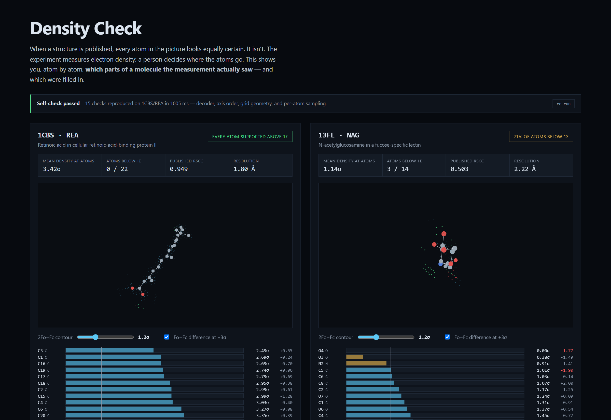

# Density Check

**What did the experiment actually see?**

When a structure is published, every atom in the picture looks equally certain. It isn't.
A crystallographic experiment measures *electron density* — a cloud. A person decides where
the atoms go inside that cloud. Usually they are right. Sometimes the density supports part
of a molecule and the rest is a reasonable guess, and the guess becomes a citable fact.

Density Check shows you, atom by atom, which parts of a modelled molecule the measurement
supports — and which were filled in.

<p align="center">
  
</p>

Left: retinoic acid in 1CBS — the measured density traces the molecule, every atom above 1σ,
published RSCC 0.949. Right: an N-acetylglucosamine in 13FL — 21% of its atoms sit below 1σ,
O4 sits at 0.0σ with −1.8σ of *negative* difference density under it, published RSCC 0.503.
Same code, same pipeline, opposite verdict.

---

## Why this is not just a viewer

The scarce thing here is not the 3D. It is being able to trust the number under it.

**The tool proves its own arithmetic before it prints anything.** On load it re-runs the entire
pipeline — fetch → BinaryCIF decode → axis reordering → grid geometry → trilinear sampling →
per-atom sigma — against a reference structure and compares 15 values to fixtures. If it cannot
reproduce them, it refuses to display numbers. A silently wrong sigma is worse than no sigma,
and a tool whose premise is "trust my number over the published picture" has to be able to
demonstrate that claim in your browser, not in a CI run you cannot see.

**The decoder is verified byte-identical to the reference implementation.**
`npm run crossvalidate` decodes live responses with both this code and [Mol\*](https://molstar.org),
and asserts every voxel matches: `max|diff| = 0.00e+0` across 39,852 voxels. The BinaryCIF
reader (msgpack → encoding chains → `IntervalQuantization` → `ByteArray`) is written from the
specification and checked against real bytes, not against a memory of a schema.

**Two traps in this format silently produce plausible, wrong output.** Both are handled and
documented at the point of divergence in [`src/lib/volume.ts`](src/lib/volume.ts):

1. `origin`, `dimensions` and `sample_count` are stored in **axis order, not xyz**. 1CBS
   returns `axis_order [1,0,2]` and `sample_count [36,27,41]`; read as xyz, every coordinate
   lands somewhere else in the unit cell and the density still looks like a plausible cloud.
2. The grid step is `dimensions / sample_count`, not `dimensions / (sample_count − 1)`. The
   two differ by ~25% in reported sigma on identical atoms. Which one is correct was decided
   **empirically, by physics** — electron density peaks on nuclei, so the correct convention is
   the one that puts density maxima closest to atom centres:

   | convention  | 1CBS/REA | 13FL/NAG |
   |-------------|----------|----------|
   | `periodic`  | 0.420 Å  | 0.884 Å  |
   | `inclusive` | 0.842 Å  | 1.055 Å  |

   With a ~0.6 Å grid step, `periodic` lands peaks within half a step of the nuclei; the other
   is off by more than a full step.

## What the numbers mean, honestly

- **2Fo−Fc is the map the depositor refined into.** It contains the ligand it is being used to
  judge, so high density there is partly circular. It answers "is there density here", not "is
  this model unbiased".
- **Fo−Fc, the difference map, is the less biased signal** — positive means unmodelled density,
  negative means an atom sits where the experiment saw nothing. That is why it is on by default
  and why negative difference density drives the verdict.
- **Raw sigma is not comparable between structures.** It confounds resolution, B-factor,
  occupancy and atomic number. Within one map it is a legitimate localisation signal, and that
  is the only way it is used here. Anything cross-entry uses the already-normalised published
  metrics (RSCC/RSR) from RCSB.
- **A z-score is withheld when there is no comparable reference population.** For 13FL there
  are not enough ordered protein atoms in a comparable B-factor band, so no z-score is shown.
  Absence is honest; a number built on nothing is not.

## Prior art

Per-atom electron-density validation is not new, and this does not claim to be first:

- **[EDIA](https://proteins.plus)** (Meyder et al., *J. Chem. Inf. Model.* 2017) computes per-atom
  density support more rigorously than this does — weighted spheres, expected density, shape as
  well as intensity.
- **Twilight** (Weichenberger & Pozharski) did archive-wide worst-first ligand ranking.
- **PDB-REDO** runs EDSTATS across the archive; **RCSB** publishes its own composite ligand
  quality score.

What is different here is the shape, not the science: zero install, runs entirely in the browser
against public endpoints with no backend and no key, and it shows its work.

## Data

Everything is fetched client-side from RCSB, which serves
`Access-Control-Allow-Origin: *` with no authentication. PDB archive data is **CC0 1.0**.

| What | Endpoint |
|---|---|
| Coordinates | `models.rcsb.org/v1/{entry}/atoms?label_comp_id={comp}` |
| Surrounding protein | `models.rcsb.org/v1/{entry}/residueSurroundings?...&radius=8` |
| Density (both maps, one request) | `maps.rcsb.org/x-ray/{entry}/box/{x1,y1,z1}/{x2,y2,z2}?detail=6` |
| Published validation | `data.rcsb.org/rest/v1/core/nonpolymer_entity_instance/{entry}/{labelAsymId}` |

A typical ligand costs ~11 KB of coordinates and 20–50 KB of density — both maps arrive in a
single BinaryCIF response.

> Note: that validation endpoint keys on the **label** asym id, not the author chain. For 1CBS
> the ligand is label asym `B` while its author chain is `A`; passing the author chain 404s on
> every entry and silently blanks the one metric that *is* comparable across structures.

## Run it

```bash
npm install && npm run dev
```

```bash
npm run crossvalidate   # decode live responses with this code and Mol*, assert every voxel matches
```

```bash
npm run verify          # re-derive the grid convention from physics against live data
```

## Status

**Stage 0.** Two reference structures, side by side, to prove the hard part: the decoder, the
geometry, the per-atom evidence, and the self-check. Next: any entry and any ligand from a URL,
then a precomputed archive-wide index so you can paste a protein target and get every ligand
ever modelled into it, ranked worst-evidence-first.

## Licence

MIT. Data from RCSB PDB under CC0 1.0.
